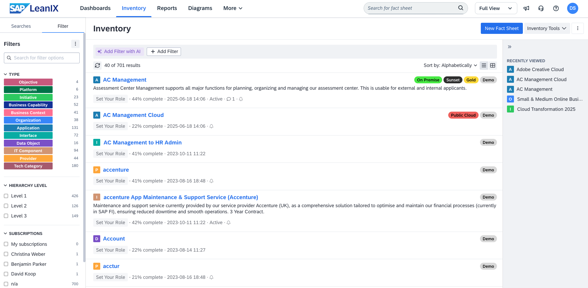
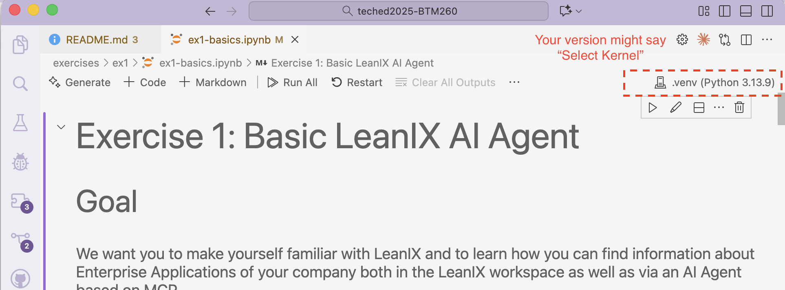
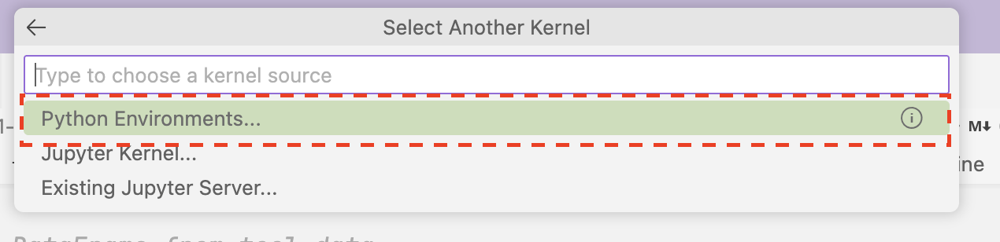
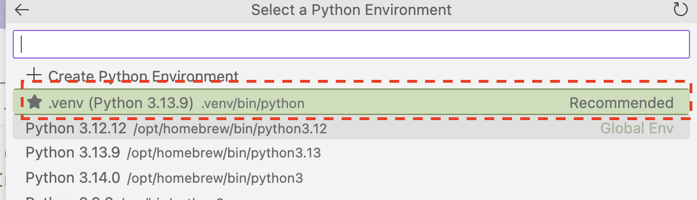

# BTM260 - Building AI agents on your SAP LeanIX solutions with Model Context Protocol (MCP)

[](https://api.reuse.software/info/github.com/SAP-samples/teched2025-BTM260)

## Description

This repository contains the material for the SAP TechEd 2025 session BTM260 - Building AI agents on your SAP LeanIX solutions with Model Context Protocol (MCP).

## Overview

LeanIX is an enterprise architecture platform that gives visibility into complex IT landscapes, including SAP environments. For those working with SAP, it helps map system dependencies, streamline S/4HANA migrations, and manage application portfolios more effectively — supporting better decisions and faster transformations.



Many large LeanIX customers usually build lots of custom integrations with other enterprise applications in order to leverage LeanIX data or to import and/or curate LeanIX data based on information from these 3rd party systems. Building such integrations based on the existing [LeanIX APIs](https://help.sap.com/docs/leanix/ea/sap-leanix-apis?locale=en-US) is a process which takes much time and effort.


With [Model Context Protocol (MCP)](https://modelcontextprotocol.io/docs/getting-started/intro) we can now leverage AI to make this process much more seamless and effective. MCP exposes APIs with semantic descriptions as **MCP tools**. These tools can be exposed to a [Large Language Model (LLM)](https://en.wikipedia.org/wiki/Large_language_model) which then dynamically decides which tools to call for a specific task. This allows for much simpler integrations with business applications.


Especially, it allows to build specialized [AI Agents](https://cloud.google.com/discover/what-are-ai-agents?hl=en) which can complete tasks on users' behalf by planning and acting independently. AI Agents leverage LLMs and can use the tools exposed by MCP Servers without further guidance by the application developer. This drastically lowers time-to-value for integrating business applications.

In this session, we show you how to **leverage MCP to access information in your LeanIX workspace**. We will use a demo workspace for this purpose which is already filled with demo data describing the IT landscape of a fictional company.
We leverage the LeanIX MCP Server to connect AI Agents built in code with the data in the LeanIX workspace.
The following picture shows the anticipated architecture. You will work on the colored components. All other components will be provided by us.

You can find detailed documentation about LeanIX MCP at <https://help.sap.com/docs/leanix/ea/mcp-server>


## Requirements

In order to be able to follow the exercises in this repository, you need:

1. A working Python installation (at least Python 3.12 is required for the dependencies)
    - You can check the Python version with `python --version` terminal command
2. [VSCode](https://code.visualstudio.com/) with [Jupyter extension](https://marketplace.visualstudio.com/items?itemName=ms-toolsai.jupyter)
    - If you are unfamiliar with Jupyter, please follow [this guide](https://code.visualstudio.com/docs/datascience/jupyter-notebooks) to get started.
3. Access to SAP BTP AI Core GenAI Hub with an active deployment of gpt-4.1 or comparable LLM
4. Admin access to a LeanIX workspace

All of this will be provided to TechEd 2025 onsite session participants.

## Install dependencies

Create & activate a virtual environment, install dependencies, and register the Jupyter kernel.

**These instructions here are for the Teched demo stations only!**

1. Open the repository folder in VSCode
2. Open integrated terminal: View -> Terminal (PowerShell - pwsh)
3. Enter the instructions below step-by-step

```
powershell -Command "Start-Process powershell -Verb runAs -ArgumentList '-NoProfile -Command `"New-ItemProperty -Path ''HKLM:\SYSTEM\CurrentControlSet\Control\FileSystem'' -Name ''LongPathsEnabled'' -Value 1 -PropertyType DWORD -Force`"'"
py -m venv .venv

.venv\Scripts\activate.ps1

pip install -r requirements.txt

py -m ipykernel install --user --name teched-workshop
```
When you open Exercise 1 or 2 for the first time, you will need to select a Python environment.

Select Kernel -> Python Environments -> .venv (Python 3.13.5)

- Open your Exercise 1 and press "Select Kernel"

- When asked, select "Python Environments.."

- Select the recommended .venv (Python 3.13.5)


*Troubleshooting*
In case you are getting a long path error, please try manually enabling this:

1. Open the Registry Editor `regedit`
2. Navigate to: Computer\HKEY_LOCAL_MACHINE\SYSTEM\CurrentControlSet\Control\FileSystem
3. Set LongPathsEnabled to 1

We will provide more generic instructions after the workshop.


## Exercises

- Exercise 1 - [Basic AI Agent loop](./exercises/ex1/ex1-basics.ipynb)
- Exercise 2 - [Build Employee Portal Chatbot](./exercises/ex2/ex2-build-employee-portal-chatbot.ipynb)

## Outlook

You can use the example code from the two exercises to continue your journey with AI Agents based on MCP and LeanIX.

Besides the Python library we are using here, you can also build your Agents in TypeScript, e.g. using the [Mastra](https://mastra.ai/) framework.

More things you can try:

- An Agent that helps you to raise data quality in LeanIX - based on policies you defined in Confluence (Combining LeanIX MCP and Confluence MCP)
- An Agent that helps you manage transformations (combining LeanIX MCP and JIRA MCP)


## Contributing

Please read the [CONTRIBUTING.md](CONTRIBUTING.md) to understand contribution guidelines.

## Code of Conduct

Please read the [SAP Open Source Code of Conduct](https://github.com/SAP-samples/.github/blob/main/CODE_OF_CONDUCT.md)

## License

Copyright (C) 2025 SAP SE or an SAP affiliate company. All rights reserved. This project is licensed under the Apache Software License, version 2.0 except as noted otherwise in the [LICENSE](./LICENSES/Apache-2.0.txt) file.
